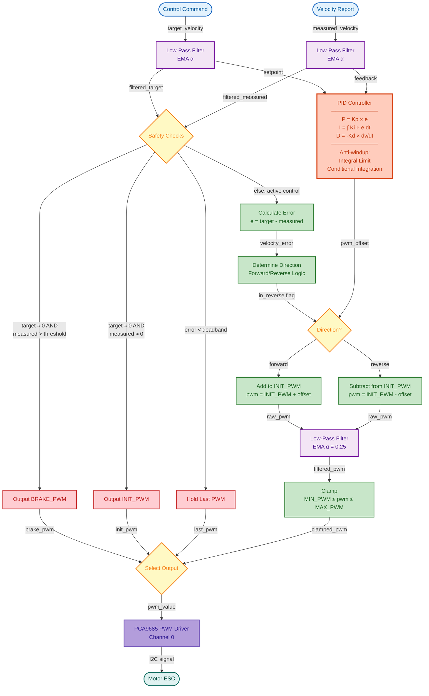

# AutoSDV Vehicle Interface

This package provides the vehicle interface components for the AutoSDV autonomous vehicle platform. It enables communication between Autoware's control commands and the vehicle's hardware actuators, as well as reporting the vehicle's velocity back to the Autoware stack.

## Overview

The AutoSDV vehicle interface consists of:

1. **Vehicle Description**: URDF and configuration files describing the vehicle's physical properties
2. **Vehicle Interface**: ROS2 nodes that interface with the vehicle's hardware
3. **Launch Files**: Configuration for launching the vehicle interface components

## Components

### 1. AutoSDV Vehicle Description

Located in `autosdv_vehicle_description/`, this package contains:

- URDF models for the vehicle (`urdf/vehicle.xacro`)
- Vehicle information parameters (`config/vehicle_info.param.yaml`)
- 3D meshes of the vehicle (`mesh/`)

### 2. AutoSDV Vehicle Interface

Located in `autosdv_vehicle_interface/`, this package contains:

- **Actuator Node**: Controls the vehicle's motor and steering servo using PWM signals via a PCA9685 PWM driver
- **Velocity Report Node**: Reads hall effect sensor data to calculate and report the vehicle's velocity

#### Actuator Node (`actuator.py`)

The actuator node subscribes to Autoware control commands and converts them into PWM signals for the vehicle's:
- Throttle/brake control (DC motor)
- Steering control (servo motor)

Features:
- Uses PID controllers for accurate speed and steering control
- Configurable parameters for different vehicles and motor setups
- Interfaces with the PCA9685 PWM driver connected via I2C

##### Longitudinal Control Workflow

The following diagram illustrates how the actuator node processes velocity commands to generate PWM signals for motor control:



Key parameters (in `params/actuator.yaml`):
- PWM frequency and I2C settings
- PID controller parameters for speed and steering
- PWM range settings for motors and servos

#### Velocity Report Node (`velocity_report.py`)

This node:
- Reads from a hall effect sensor connected to a GPIO pin
- Calculates vehicle velocity based on wheel rotation
- Publishes velocity reports to the Autoware stack

Key parameters (in `params/velocity_report.yaml`):
- GPIO pin configuration
- Wheel diameter and markers per rotation
- Publication rate settings

### 3. AutoSDV Vehicle Launch

Located in `autosdv_vehicle_launch/`, this package contains:
- Launch files for starting the vehicle interface (`launch/vehicle_interface.launch.xml`)
- Configuration for remapping topics between the vehicle interface and Autoware

## Usage

### Launching the Vehicle Interface

The vehicle interface can be launched using:

```bash
ros2 launch autosdv_vehicle_launch vehicle_interface.launch.xml
```

This launch file starts both the actuator and velocity report nodes with the appropriate parameters and topic remappings.

### Integration with Autoware

The vehicle interface integrates with Autoware through the following topics:

- Input: `/control/command/control_cmd` - Control commands from Autoware
- Output: `/vehicle/status/velocity_status` - Vehicle velocity information

## Configuration

The behavior of the vehicle interface can be customized by modifying the parameter files:

- `params/actuator.yaml`: Configure motor control settings, PID parameters, and PWM ranges
- `params/velocity_report.yaml`: Configure velocity reporting settings, wheel dimensions, and sensor settings

## Hardware Requirements

The vehicle interface is designed to work with:

- PCA9685 PWM driver for motor and servo control (connected via I2C)
- Hall effect sensor (KY-003) for velocity measurement (connected to GPIO)
- DC motor and servo motor for vehicle movement and steering

## Dependencies

- ROS 2 Humble
- Adafruit_PCA9685 Python library
- simple_pid Python library
- Jetson.GPIO Python library
