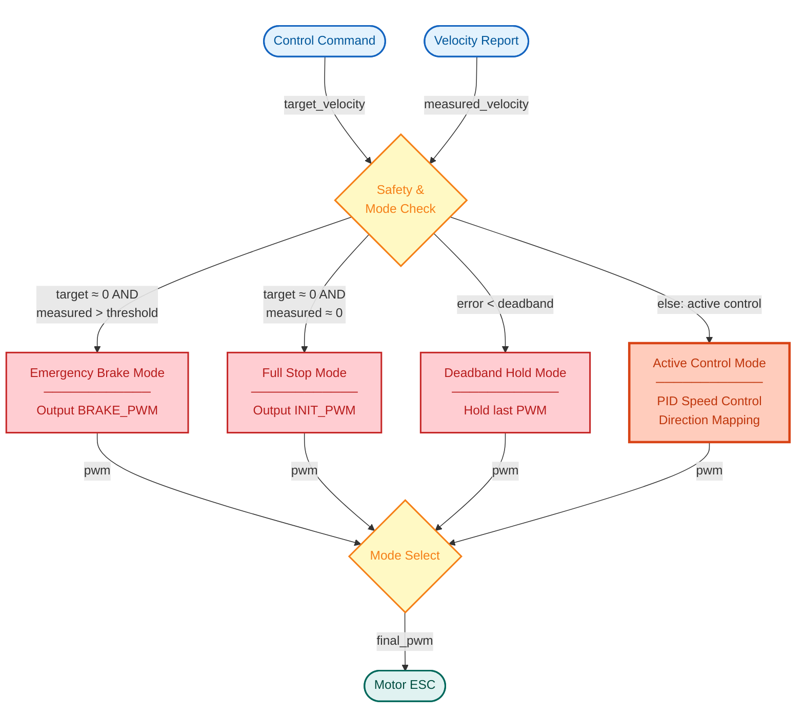
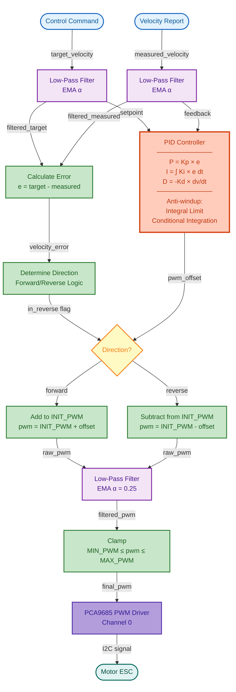
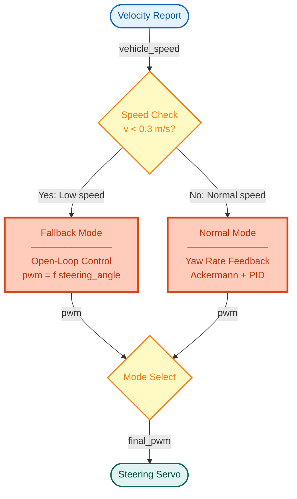
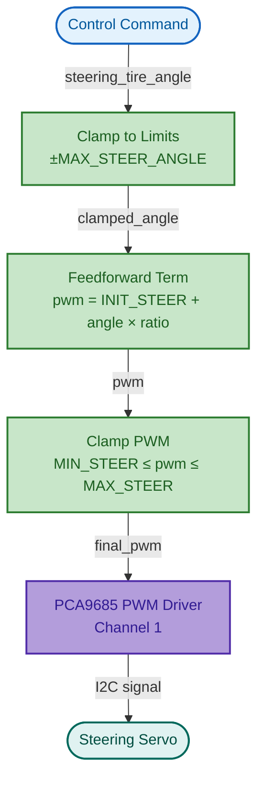
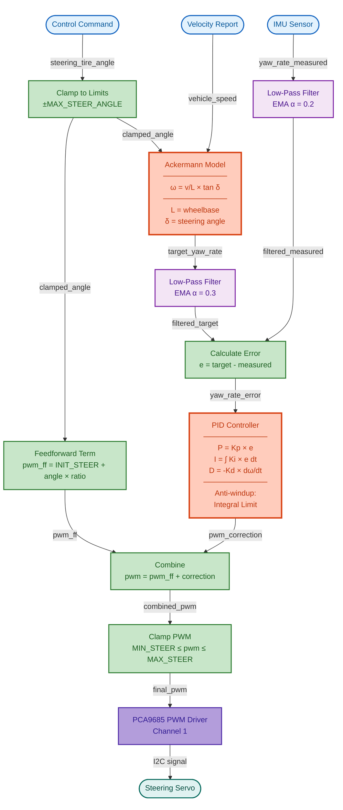

# AutoSDV Vehicle Interface

This package implements the actuator control and velocity reporting for the AutoSDV autonomous vehicle platform.

## Overview

The vehicle interface consists of two main nodes:

- **Actuator Node** (`actuator.py`): Converts Autoware control commands to PWM signals for motor and steering
- **Velocity Report Node** (`velocity_report.py`): Reads hall effect sensor data and publishes vehicle velocity

## Longitudinal Control (Speed Control)

The actuator node implements a multi-mode longitudinal controller that manages motor PWM based on vehicle speed commands.

### Control Modes Overview

The controller operates in four modes:
- **Emergency Brake**: Apply brake PWM when target is near zero but vehicle is still moving
- **Full Stop**: Output neutral PWM when both target and measured velocities are near zero
- **Deadband Hold**: Maintain current PWM when velocity error is within deadband (prevents jitter)
- **Active Control**: PID-based speed control with forward/reverse direction mapping

### Active Control Mode Details

Active control mode features:
- Low-pass filtering on both target and measured velocities
- PID controller with anti-windup protection
- Forward/reverse direction logic
- Direction-specific PWM mapping (INIT_PWM ± offset)
- Output PWM filtering for smooth transitions
- Saturation to hardware limits

## Lateral Control (Steering Control)

The actuator node implements a dual-mode steering controller that switches between open-loop and closed-loop control based on vehicle speed.

### Control Modes Overview

The controller operates in two modes based on vehicle speed:
- **Fallback Mode** (v < 0.3 m/s): Open-loop feedforward control for standstill/low speeds
- **Normal Mode** (v ≥ 0.3 m/s): Yaw rate feedback control using Ackermann model and PID

### Fallback Mode Details (Low Speed)

Fallback mode features:
- Simple feedforward control: `pwm = INIT_STEER + angle × ratio`
- No feedback required (yaw rate is unreliable at low speeds)
- Direct angle-to-PWM mapping with saturation

### Normal Mode Details (Normal Speed)

Normal mode features:
- Ackermann kinematic model converts steering angle to target yaw rate
- IMU provides measured yaw rate feedback
- PID controller minimizes yaw rate error
- Feedforward + feedback architecture for fast response
- Low-pass filtering on both target and measured signals
- Disturbance rejection (compensates for tire slip, wind, etc.)

## Velocity Reporting

The velocity report node reads hall effect sensor data and publishes vehicle velocity.

### Features
- Reads from hall effect sensor (KY-003) connected to GPIO pin
- Calculates vehicle velocity based on wheel rotation
- Publishes velocity reports to Autoware stack

### Configuration Parameters

Velocity reporting is configured in `params/velocity_report.yaml`:
- GPIO pin configuration
- Wheel diameter and markers per rotation
- Publication rate settings

## Configuration

Control parameters are configured in `params/actuator.yaml`:

### Longitudinal Control Parameters
- `kp_speed`, `ki_speed`, `kd_speed`: PID gains for speed control
- `integral_limit`: Anti-windup limit for integral term
- `enable_conditional_integration`: Stop integration when output saturated
- `velocity_deadband`: Error threshold for hold mode (prevents jitter)
- `full_stop_threshold`: Threshold for full stop detection
- `brake_threshold`: Threshold for emergency brake activation
- `velocity_measurement_filter_alpha`: Low-pass filter coefficient for measured velocity
- `velocity_command_filter_alpha`: Low-pass filter coefficient for target velocity
- PWM values: `min_pwm` (280), `init_pwm` (370), `max_pwm` (460), `brake_pwm` (340)

### Lateral Control Parameters
- `kp_steer`, `ki_steer`, `kd_steer`: PID gains for yaw rate control
- `max_steering_angle`: Vehicle maximum steering angle (0.349 rad ≈ 20°, from `vehicle_info.param.yaml`)
- `tire_angle_to_steer_ratio`: Conversion from radians to PWM units
- `steering_speed`: Maximum steering rate (rad/s)
- PWM values: `min_steer` (350), `init_steer` (400), `max_steer` (450)

## Hardware Interface

- **PCA9685 PWM Driver** (I2C)
  - Channel 0: Motor ESC
  - Channel 1: Steering servo
  - Default: I2C address 0x40, bus 1, 60 Hz PWM frequency

- **IMU Sensor** (for steering yaw rate feedback)
  - Provides angular velocity measurement
  - Required for normal mode steering control

## Topics

### Subscriptions
- `~/input/control_cmd` (`autoware_control_msgs/msg/Control`): Control commands from Autoware
- `~/input/velocity_status` (`autoware_vehicle_msgs/msg/VelocityReport`): Current vehicle velocity
- `~/input/imu` (`sensor_msgs/msg/Imu`): IMU data for yaw rate feedback

### Publications
- `~/debug/control_values` (`autoware_internal_debug_msgs/msg/Float32MultiArrayStamped`): Debug control values
- `~/debug/pwm_values` (`autoware_internal_debug_msgs/msg/Float32MultiArrayStamped`): Debug PWM outputs
- `~/debug/pid_values` (`autoware_internal_debug_msgs/msg/Float32MultiArrayStamped`): Debug PID state
