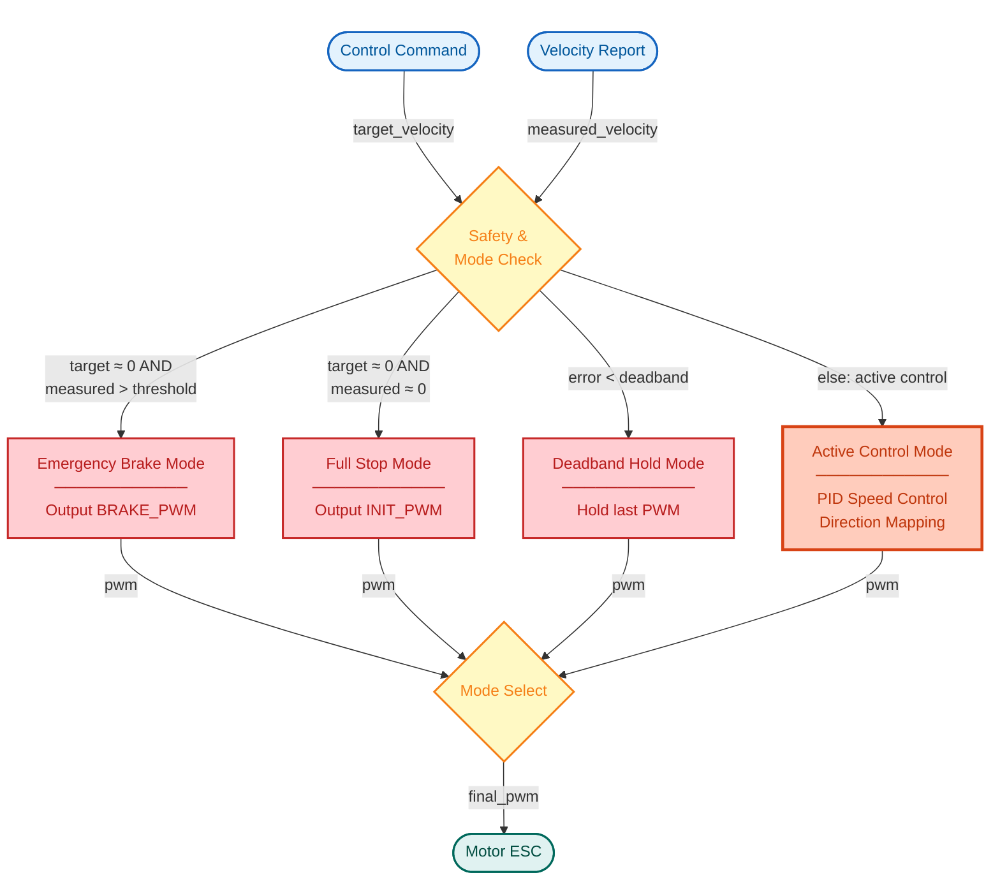
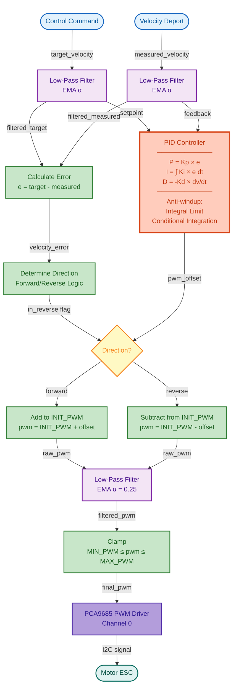
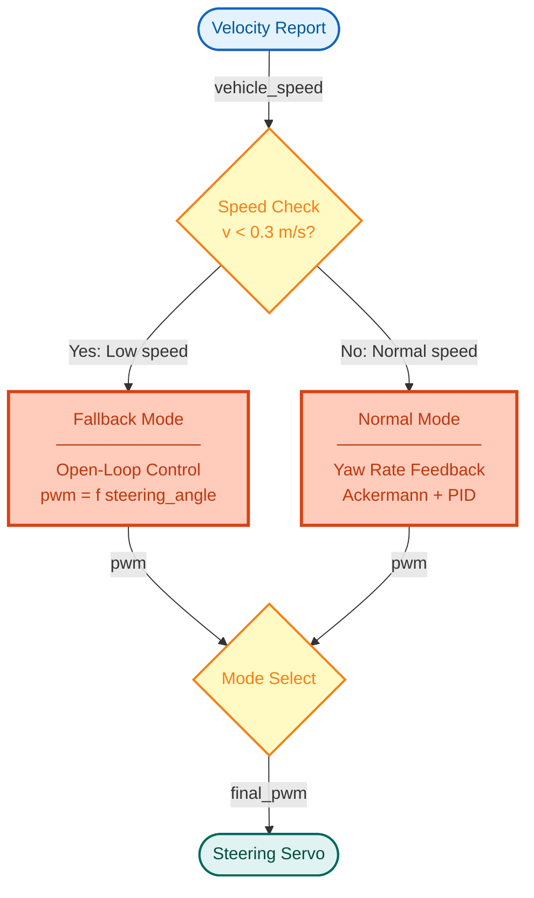
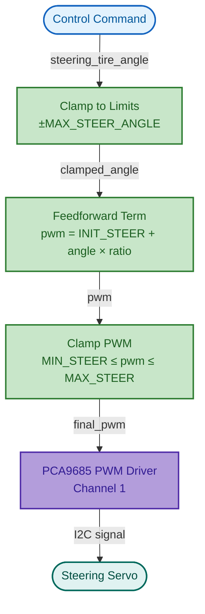
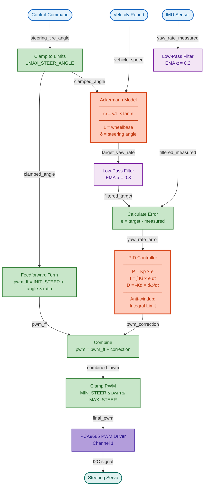

# AutoSDV Vehicle Interface

This package implements the actuator control and velocity reporting for the AutoSDV autonomous vehicle platform.

## Overview

The vehicle interface consists of two main nodes:

- **Actuator Node** (`actuator.py`): Converts Autoware control commands to PWM signals for motor and steering
- **Velocity Report Node** (`velocity_report.py`): Reads hall effect sensor data and publishes vehicle velocity

## Longitudinal Control (Speed Control)

The actuator node implements a multi-mode longitudinal controller that manages motor PWM based on vehicle speed commands.

### Control Modes Overview


```mermaid
flowchart TD
    %% Data Sources - Grouped in invisible subgraph
    subgraph DataSources [" "]
        ControlCmd([Control Command])
        VelReport([Velocity Report])
    end

    %% Control mode selection
    ControlCmd -->|target_velocity| SafetyCheck{Safety &<br/>Mode Check}
    VelReport -->|measured_velocity| SafetyCheck

    %% Emergency Brake Mode
    SafetyCheck -->|target ≈ 0 AND<br/>measured > threshold| EmergencyBrake[Emergency Brake Mode<br/>────────────<br/>Output BRAKE_PWM]

    %% Full Stop Mode
    SafetyCheck -->|target ≈ 0 AND<br/>measured ≈ 0| FullStop[Full Stop Mode<br/>────────────<br/>Output INIT_PWM]

    %% Deadband Hold Mode
    SafetyCheck -->|error < deadband| DeadbandHold[Deadband Hold Mode<br/>────────────<br/>Hold last PWM]

    %% Active Control Mode
    SafetyCheck -->|else: active control| ActiveControl[Active Control Mode<br/>────────────<br/>PID Speed Control<br/>Direction Mapping]

    %% Output Selection
    EmergencyBrake -->|pwm| OutputMux{Mode Select}
    FullStop -->|pwm| OutputMux
    DeadbandHold -->|pwm| OutputMux
    ActiveControl -->|pwm| OutputMux

    %% Final Output
    OutputMux -->|final_pwm| Motor([Motor ESC])

    %% Styling with darker text for bright backgrounds
    classDef sourceClass fill:#e3f2fd,stroke:#1565c0,stroke-width:2px,color:#01579b
    classDef decisionClass fill:#fff9c4,stroke:#f57f17,stroke-width:2px,color:#f57f17
    classDef modeClass fill:#ffccbc,stroke:#d84315,stroke-width:3px,color:#bf360c
    classDef specialClass fill:#ffcdd2,stroke:#c62828,stroke-width:2px,color:#b71c1c
    classDef sinkClass fill:#e0f2f1,stroke:#00695c,stroke-width:2px,color:#004d40
    classDef invisibleGroup fill:none,stroke:none

    class ControlCmd,VelReport sourceClass
    class SafetyCheck,OutputMux decisionClass
    class ActiveControl modeClass
    class EmergencyBrake,FullStop,DeadbandHold specialClass
    class Motor sinkClass
    class DataSources invisibleGroup
```

The controller operates in four modes:
- **Emergency Brake**: Apply brake PWM when target is near zero but vehicle is still moving
- **Full Stop**: Output neutral PWM when both target and measured velocities are near zero
- **Deadband Hold**: Maintain current PWM when velocity error is within deadband (prevents jitter)
- **Active Control**: PID-based speed control with forward/reverse direction mapping

Mode selection lives in `longitudinal.py` (`LongitudinalShell`, no ROS
dependency); the PID behind Active Control is a plug-in (see
[Speed Controller Plug-in](#speed-controller-plug-in)). The current mode is
published on `~/debug/mode` when it changes, with the override reason appended
(`override_brake:command_timeout`).

### Safety Overrides

Above the four modes sit overrides that stop the motor whatever the command
says. They are checked first on every tick, and no speed controller can bypass
them:

| Override | Trigger | Default |
|---|---|---|
| `command_timeout` | no **usable** `~/input/control_cmd` for `control_cmd_timeout` | 0.3 s |
| `velocity_timeout` | no `~/input/velocity_status` for `velocity_timeout` | 0.5 s |
| `emergency` | `~/input/emergency` (`tier4_vehicle_msgs/VehicleEmergencyStamped`, the gate's `/control/command/emergency_cmd`) says emergency, or `~/input/mrm_state` (`autoware_adapi_v1_msgs/MrmState`, `/system/fail_safe/mrm_state`) is an MRM that requires a stop | on |
| `controller_fault` | the speed controller raised, or returned something that is not a finite number | -- |

Every override does the same thing: **brake, then neutral**. `brake_pwm` is
applied while the vehicle is moving faster than `brake_threshold` -- judged by
the current speed, else the last reading seen, else by whether the motor was
being driven forward -- for at most `override_brake_duration` (1.5 s), then
`init_pwm`. A vehicle that is already stopped goes straight to neutral, because
holding `brake_pwm` on a stopped car can make the ESC reverse. During a
`command_timeout` the steering is centred (`init_steer`); otherwise it keeps
following the commands. Each episode is logged once when it starts and once
when it clears; on clearing, the speed controller is `reset()` and control
resumes on the next tick.

A command is **usable** when its velocity and steering angle are finite and
its header stamp is within `control_cmd_max_stamp_age` (0.5 s) of the node's
clock. Unusable commands are dropped -- they do not feed the watchdog -- and
the reason is logged once per run of identical rejections. Unstamped commands
(stamp zero) are accepted. A stamp more than 10 s off is reported as a
`use_sim_time` mismatch between publisher and actuator; set
`control_cmd_max_stamp_age: 0.0` to disable the stamp check.

An MRM requires a stop when it has failed, or is operating/succeeded with the
emergency-stop behaviour (the gate's own rule) -- or, with
`emergency_stop_on_any_mrm: true` (the default), for any behaviour. The default
is deliberately strict: a comfortable stop acts through the planning velocity
limit, which a planner that bypasses Autoware planning (the Lab 2 pursuit
planner) ignores.

**On exit** -- normal shutdown, SIGINT, SIGTERM, or an exception out of the
executor -- the node cancels its timer and writes `init_pwm` to the motor and
`init_steer` to the steering (also registered with `atexit`). The write runs on
a daemon thread bounded by `neutral_write_timeout` (0.5 s), so a hung I2C bus
cannot keep the process alive. SIGKILL, a kernel panic or a power cut cannot be
handled in software: the PCA9685 then holds its last duty cycle, which is what
the hardware kill switch is for.

### Speed Controller Plug-in

Active Control calls a speed controller selected by import path:

```python
class SpeedPID:
    def __init__(self, params: dict): ...
    def reset(self) -> None: ...
    def update(self, target_speed: float, measured_speed: float, dt: float) -> int:
        """Return the motor PWM count. The actuator clamps and overrides it."""
```

- `speed_controller_class` -- `"pkg.module:Class"`. The default,
  `autosdv_vehicle_interface.speed_controller:AckermannSpeedPID`, is the PID
  this node has always run; `test/test_speed_controller_equivalence.py` checks
  it against a frozen copy of the pre-plug-in code, tick for tick. The node
  refuses to start if the class cannot be loaded, rather than drive with a
  controller nobody selected.
- `speed_controller_params` -- a YAML mapping in a string (ROS parameters
  cannot hold a dictionary), merged over the motor parameters the controller
  always receives: `init_pwm`, `min_pwm`, `max_pwm`, `brake_pwm`, `rate`, and
  the `kp_speed` ... `derivative_filter_alpha` PID settings. Example:
  `speed_controller_params: "{kp: 20.0, ki: 4.0}"`.
- `measured_speed` is the velocity report after the shell's EMA (alpha 0.3).
  The hall sensor has no direction, so it is never negative on the vehicle.
- `dt` depends on `speed_controller_dt_source`. `"velocity_report"` (default,
  the legacy behaviour) is the time since the last velocity report, which with
  20 Hz reports and a 100 Hz loop runs 0.01 ... 0.05 s and makes the effective
  integral gain about 3x `ki_speed`. `"loop"` is the loop period. Tune on the
  bench with the same setting the vehicle uses.
- The output is clamped to `[min_pwm, max_pwm]`. Note that the default PID
  limits its own offset to `+-(max_pwm - min_pwm) // 2`, so with the shipped
  values it never commands more than 425.
- `update()` is called only in Active Control; `reset()` after every override
  episode. An exception from either, or a non-finite/non-numeric return, sends
  the motor to neutral (braking first if moving) with a traceback in the log;
  after `controller_fault_holdoff` (1 s) the controller is reset and retried,
  and after `controller_max_faults` (3) faults it stays disabled until the node
  restarts. The node itself never crashes on a controller error.

### Offline Bench (motor plant model)

`motor_plant.py` models the drive train (first-order response toward a speed
linear in PWM beyond a deadband around `init_pwm`, braking below it, coasting
inside it) and the `velocity_report` node (edge timing on 12 wheel markers,
EMA, 20 Hz, 0.5 s zero timeout, unsigned). `speed_bench.py` runs a speed
controller against it through the same `LongitudinalShell` the vehicle uses
and reports rise time, overshoot, steady-state error and settling time:

```bash
ros2 run autosdv_vehicle_interface speed_bench
ros2 run autosdv_vehicle_interface speed_bench \
    --controller my_pkg.speed_pid:SpeedPID --params '{kp: 20.0}' \
    --target 1.0 --duration 8 --csv tmp/step.csv
```

**The plant parameters are provisional** (`MotorPlantParams`: deadband 5
counts, 0.03 m/s per count, time constant 0.4 s, coast 1.5 s, brake 3 m/s²).
They are consistent with `actuator.yaml` but not fitted; fit them from bags of
`~/debug/pwm_values` against `/vehicle/status/velocity_status` before the bench
is used to judge gains.

### Active Control Mode Details


```mermaid
flowchart TD
    %% Active Control Mode - Detailed PID Speed Control

    %% Input Sources - Grouped in invisible subgraph
    subgraph DataSources [" "]
        ControlCmd([Control Command])
        VelReport([Velocity Report])
    end

    %% Flow from sources
    ControlCmd -->|target_velocity| FilterCmd[Low-Pass Filter<br/>EMA α]
    VelReport -->|measured_velocity| FilterMeas[Low-Pass Filter<br/>EMA α]

    %% Filtered velocities
    FilterCmd -->|filtered_target| ErrorCalc[Calculate Error<br/>e = target - measured]
    FilterMeas -->|filtered_measured| ErrorCalc

    %% Reverse logic
    ErrorCalc -->|velocity_error| ReverseLogic[Determine Direction<br/>Forward/Reverse Logic]

    ReverseLogic -->|in_reverse flag| DirectionMap

    %% PID Controller
    FilterCmd -->|setpoint| PIDController[PID Controller<br/>────────────<br/>P = Kp × e<br/>I = ∫ Ki × e dt<br/>D = -Kd × dv/dt<br/>────────────<br/>Anti-windup:<br/>Integral Limit<br/>Conditional Integration]
    FilterMeas -->|feedback| PIDController

    %% PID output
    PIDController -->|pwm_offset| DirectionMap{Direction?}

    %% Direction-based PWM calculation
    DirectionMap -->|forward| PWMCalcFwd[Add to INIT_PWM<br/>pwm = INIT_PWM + offset]
    DirectionMap -->|reverse| PWMCalcRev[Subtract from INIT_PWM<br/>pwm = INIT_PWM - offset]

    %% Output filtering
    PWMCalcFwd -->|raw_pwm| PWMFilter[Low-Pass Filter<br/>EMA α = 0.25]
    PWMCalcRev -->|raw_pwm| PWMFilter

    PWMFilter -->|filtered_pwm| Saturate[Clamp<br/>MIN_PWM ≤ pwm ≤ MAX_PWM]

    Saturate -->|final_pwm| HardwareDriver[PCA9685 PWM Driver<br/>Channel 0]

    HardwareDriver -->|I2C signal| Motor([Motor ESC])

    %% Styling with darker text for bright backgrounds
    classDef sourceClass fill:#e3f2fd,stroke:#1565c0,stroke-width:2px,color:#01579b
    classDef filterClass fill:#f3e5f5,stroke:#7b1fa2,stroke-width:2px,color:#4a148c
    classDef decisionClass fill:#fff9c4,stroke:#f57f17,stroke-width:2px,color:#f57f17
    classDef controlClass fill:#ffccbc,stroke:#d84315,stroke-width:3px,color:#bf360c
    classDef calcClass fill:#c8e6c9,stroke:#2e7d32,stroke-width:2px,color:#1b5e20
    classDef outputClass fill:#b39ddb,stroke:#512da8,stroke-width:2px,color:#311b92
    classDef sinkClass fill:#e0f2f1,stroke:#00695c,stroke-width:2px,color:#004d40
    classDef invisibleGroup fill:none,stroke:none

    class ControlCmd,VelReport sourceClass
    class FilterCmd,FilterMeas,PWMFilter filterClass
    class DirectionMap decisionClass
    class PIDController controlClass
    class ErrorCalc,ReverseLogic,PWMCalcFwd,PWMCalcRev,Saturate calcClass
    class HardwareDriver outputClass
    class Motor sinkClass
    class DataSources invisibleGroup
```

Active control mode features:
- Low-pass filtering on both target and measured velocities
- PID controller with anti-windup protection
- Forward/reverse direction logic
- Direction-specific PWM mapping (INIT_PWM ± offset)
- Output PWM filtering for smooth transitions
- Saturation to hardware limits

## Lateral Control (Steering Control)

The actuator node implements a dual-mode steering controller that switches between open-loop and closed-loop control based on vehicle speed.

### Control Modes Overview


```mermaid
flowchart TD
    %% Data Source
    VelReport([Velocity Report])

    %% Speed-based mode selection
    VelReport -->|vehicle_speed| SpeedCheck{Speed Check<br/>v < 0.3 m/s?}

    %% Fallback Mode
    SpeedCheck -->|Yes: Low speed| FallbackMode[Fallback Mode<br/>────────────<br/>Open-Loop Control<br/>pwm = f steering_angle]

    %% Normal Mode
    SpeedCheck -->|No: Normal speed| NormalMode[Normal Mode<br/>────────────<br/>Yaw Rate Feedback<br/>Ackermann + PID]

    %% Output
    FallbackMode -->|pwm| OutputMux{Mode Select}
    NormalMode -->|pwm| OutputMux

    OutputMux -->|final_pwm| Servo([Steering Servo])

    %% Styling with darker text for bright backgrounds
    classDef sourceClass fill:#e3f2fd,stroke:#1565c0,stroke-width:2px,color:#01579b
    classDef decisionClass fill:#fff9c4,stroke:#f57f17,stroke-width:2px,color:#f57f17
    classDef modeClass fill:#ffccbc,stroke:#d84315,stroke-width:3px,color:#bf360c
    classDef sinkClass fill:#e0f2f1,stroke:#00695c,stroke-width:2px,color:#004d40

    class VelReport sourceClass
    class SpeedCheck,OutputMux decisionClass
    class FallbackMode,NormalMode modeClass
    class Servo sinkClass
```

The controller operates in two modes based on vehicle speed:
- **Fallback Mode** (v < 0.3 m/s): Open-loop feedforward control for standstill/low speeds
- **Normal Mode** (v ≥ 0.3 m/s): Yaw rate feedback control using Ackermann model and PID

### Fallback Mode Details (Low Speed)


```mermaid
flowchart TD
    %% Fallback Mode: Low Speed (v < 0.3 m/s) - Open-Loop Control

    %% Input Sources
    ControlCmd([Control Command])

    %% Flow
    ControlCmd -->|steering_tire_angle| ClampAngle[Clamp to Limits<br/>±MAX_STEER_ANGLE]

    ClampAngle -->|clamped_angle| Feedforward[Feedforward Term<br/>pwm = INIT_STEER + angle × ratio]

    Feedforward -->|pwm| Saturate[Clamp PWM<br/>MIN_STEER ≤ pwm ≤ MAX_STEER]

    Saturate -->|final_pwm| ServoDriver[PCA9685 PWM Driver<br/>Channel 1]

    ServoDriver -->|I2C signal| Servo([Steering Servo])

    %% Styling with darker text for bright backgrounds
    classDef sourceClass fill:#e3f2fd,stroke:#1565c0,stroke-width:2px,color:#01579b
    classDef calcClass fill:#c8e6c9,stroke:#2e7d32,stroke-width:2px,color:#1b5e20
    classDef outputClass fill:#b39ddb,stroke:#512da8,stroke-width:2px,color:#311b92
    classDef sinkClass fill:#e0f2f1,stroke:#00695c,stroke-width:2px,color:#004d40

    class ControlCmd sourceClass
    class ClampAngle,Feedforward,Saturate calcClass
    class ServoDriver outputClass
    class Servo sinkClass
```

Fallback mode features:
- Simple feedforward control: `pwm = INIT_STEER + angle × ratio`
- No feedback required (yaw rate is unreliable at low speeds)
- Direct angle-to-PWM mapping with saturation

### Normal Mode Details (Normal Speed)


```mermaid
flowchart TD
    %% Normal Mode: Normal Speed (v ≥ 0.3 m/s) - Yaw Rate Feedback Control

    %% Input Sources - Grouped in invisible subgraph
    subgraph DataSources [" "]
        ControlCmd([Control Command])
        VelReport([Velocity Report])
        IMU([IMU Sensor])
    end

    %% Flow from sources
    ControlCmd -->|steering_tire_angle| ClampAngle[Clamp to Limits<br/>±MAX_STEER_ANGLE]
    VelReport -->|vehicle_speed| AckermannModel
    IMU -->|yaw_rate_measured| FilterMeas[Low-Pass Filter<br/>EMA α = 0.2]

    %% Ackermann model
    ClampAngle -->|clamped_angle| AckermannModel[Ackermann Model<br/>────────────<br/>ω = v/L × tan δ<br/>────────────<br/>L = wheelbase<br/>δ = steering angle]

    AckermannModel -->|target_yaw_rate| FilterTarget[Low-Pass Filter<br/>EMA α = 0.3]

    %% Control loop
    FilterTarget -->|filtered_target| ErrorCalc[Calculate Error<br/>e = target - measured]
    FilterMeas -->|filtered_measured| ErrorCalc

    ErrorCalc -->|yaw_rate_error| PIDController[PID Controller<br/>────────────<br/>P = Kp × e<br/>I = ∫ Ki × e dt<br/>D = -Kd × dω/dt<br/>────────────<br/>Anti-windup:<br/>Integral Limit]

    PIDController -->|pwm_correction| Combiner[Combine<br/>pwm = pwm_ff + correction]

    %% Feedforward path
    ClampAngle -->|clamped_angle| Feedforward[Feedforward Term<br/>pwm_ff = INIT_STEER + angle × ratio]
    Feedforward -->|pwm_ff| Combiner

    %% Output processing
    Combiner -->|combined_pwm| Saturate[Clamp PWM<br/>MIN_STEER ≤ pwm ≤ MAX_STEER]

    Saturate -->|final_pwm| ServoDriver[PCA9685 PWM Driver<br/>Channel 1]

    ServoDriver -->|I2C signal| Servo([Steering Servo])

    %% Styling with darker text for bright backgrounds
    classDef sourceClass fill:#e3f2fd,stroke:#1565c0,stroke-width:2px,color:#01579b
    classDef filterClass fill:#f3e5f5,stroke:#7b1fa2,stroke-width:2px,color:#4a148c
    classDef modelClass fill:#ffccbc,stroke:#d84315,stroke-width:3px,color:#bf360c
    classDef controlClass fill:#ffccbc,stroke:#d84315,stroke-width:3px,color:#bf360c
    classDef calcClass fill:#c8e6c9,stroke:#2e7d32,stroke-width:2px,color:#1b5e20
    classDef outputClass fill:#b39ddb,stroke:#512da8,stroke-width:2px,color:#311b92
    classDef sinkClass fill:#e0f2f1,stroke:#00695c,stroke-width:2px,color:#004d40
    classDef invisibleGroup fill:none,stroke:none

    class ControlCmd,VelReport,IMU sourceClass
    class FilterTarget,FilterMeas filterClass
    class AckermannModel modelClass
    class PIDController controlClass
    class ErrorCalc,ClampAngle,Feedforward,Combiner,Saturate calcClass
    class ServoDriver outputClass
    class Servo sinkClass
    class DataSources invisibleGroup
```

Normal mode features:
- Ackermann kinematic model converts steering angle to target yaw rate
- IMU provides measured yaw rate feedback
- PID controller minimizes yaw rate error
- Feedforward + feedback architecture for fast response
- Low-pass filtering on both target and measured signals
- Disturbance rejection (compensates for tire slip, wind, etc.)

## Velocity Reporting

The velocity report node reads hall effect sensor data and publishes vehicle velocity.

### Features
- Reads from hall effect sensor (KY-003) connected to GPIO pin
- Calculates vehicle velocity based on wheel rotation
- Publishes velocity reports to Autoware stack

### Configuration Parameters

Velocity reporting is configured in `params/velocity_report.yaml`:
- GPIO pin configuration
- Wheel diameter and markers per rotation
- Publication rate settings

## Configuration

Control parameters are configured in `params/actuator.yaml`:

### Longitudinal Control Parameters
- `kp_speed`, `ki_speed`, `kd_speed`: PID gains for speed control
- `integral_limit`: Anti-windup limit for integral term
- `enable_conditional_integration`: Stop integration when output saturated
- `velocity_deadband`: Error threshold for hold mode (prevents jitter)
- `full_stop_threshold`: Threshold for full stop detection
- `brake_threshold`: Threshold for emergency brake activation
- `velocity_measurement_filter_alpha`: Low-pass filter coefficient for measured velocity
- `velocity_command_filter_alpha`: Low-pass filter coefficient for target velocity
- PWM values: `min_pwm` (360), `init_pwm` (370), `max_pwm` (470), `brake_pwm` (340)

### Safety and Plug-in Parameters
- `control_cmd_timeout` (0.3 s): command watchdog
- `control_cmd_max_stamp_age` (0.5 s): reject commands stamped further than this from now; 0 disables
- `velocity_timeout` (0.5 s): velocity-report watchdog; 0 disables
- `override_brake_duration` (1.5 s): longest brake at the start of an override
- `enable_emergency_input` (true): subscribe to the gate's emergency output and the MRM state
- `emergency_stop_on_any_mrm` (true): stop on any MRM, not only emergency-stop ones
- `neutral_write_timeout` (0.5 s): bound on the neutral write at exit
- `speed_controller_class`, `speed_controller_params`, `speed_controller_dt_source`
- `controller_fault_holdoff` (1.0 s), `controller_max_faults` (3)

### Lateral Control Parameters
- `kp_steer`, `ki_steer`, `kd_steer`: PID gains for yaw rate control
- `max_steering_angle`: Vehicle maximum steering angle (0.349 rad ≈ 20°, from `vehicle_info.param.yaml`)
- `tire_angle_to_steer_ratio`: Conversion from radians to PWM units
- `steering_speed`: Maximum steering rate (rad/s)
- PWM values: `min_steer` (350), `init_steer` (400), `max_steer` (450)

## Hardware Interface

- **PCA9685 PWM Driver** (I2C)
  - Channel 0: Motor ESC
  - Channel 1: Steering servo
  - Default: I2C address 0x40, bus 1, 60 Hz PWM frequency

- **IMU Sensor** (for steering yaw rate feedback)
  - Provides angular velocity measurement
  - Required for normal mode steering control

## Topics

### Subscriptions
- `~/input/control_cmd` (`autoware_control_msgs/msg/Control`): Control commands from Autoware
- `~/input/velocity_status` (`autoware_vehicle_msgs/msg/VelocityReport`): Current vehicle velocity
- `~/input/emergency` (`tier4_vehicle_msgs/msg/VehicleEmergencyStamped`): vehicle_cmd_gate's emergency output, remapped to `/control/command/emergency_cmd`
- `~/input/mrm_state` (`autoware_adapi_v1_msgs/msg/MrmState`): MRM state, remapped to `/system/fail_safe/mrm_state`

### Publications
- `~/debug/control_values` (`autoware_internal_debug_msgs/msg/Float32MultiArrayStamped`): Debug control values
- `~/debug/pwm_values` (`autoware_internal_debug_msgs/msg/Float32MultiArrayStamped`): Debug PWM outputs
- `~/debug/pid_values` (`autoware_internal_debug_msgs/msg/Float32MultiArrayStamped`): Debug PID state (P, I, D are zero for a plug-in without `debug_terms()`)
- `~/debug/mode` (`std_msgs/msg/String`, transient local): longitudinal mode on change, e.g. `active`, `brake`, `override_neutral:emergency`

## Tests

All tests run without hardware: the PCA9685 is replaced by a fake, and GPIO is
never imported.

```bash
colcon build --base-paths src --symlink-install --cmake-args -DCMAKE_BUILD_TYPE=Release \
    --packages-select autosdv_vehicle_interface
colcon test --base-paths src --packages-select autosdv_vehicle_interface
colcon test-result --verbose --test-result-base build/autosdv_vehicle_interface
```

`test_actuator_node.py` needs rclpy and the Autoware message packages and
starts real processes; run it with a private `ROS_DOMAIN_ID`.
